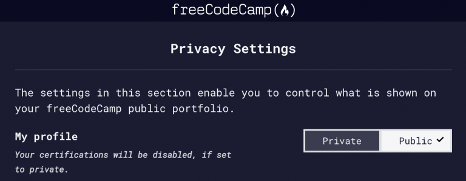
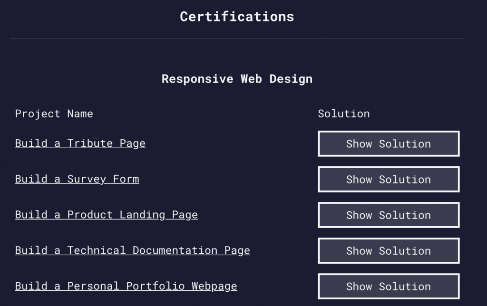
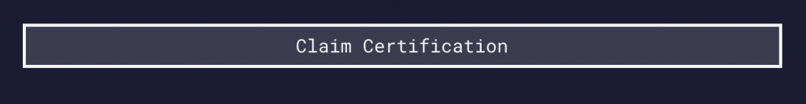
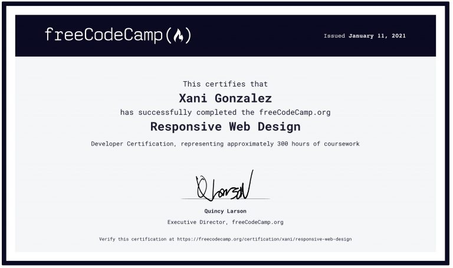

Yay, you have put all your effort and you have finished all Free Code Camp’s Responsive Web Design Challenges and all 5 projects passed, but you cannot find your beautiful certificate anywhere on your profile?

Do not panic, that happened to me as well.

First of all, from your profile, go to your Settings page.

Once there, make sure your Name is written correctly, this is the Name that will appear on your certificate.

Now, make sure to have your Profile AND your Certifications set to Public, otherwise, your certifications will be disabled. (You’ll see a checkmark on the option you have selected).

Ok, now the fun part.

Scroll all the way down on this Settings page, to the Certifications section and you will see a snippet like this one:

Right there, you will see a button that says Claim Certification:

And just a few seconds later you’ll have a gorgeous Certificate to show your accomplishment. Go and share it with the world!

And in case you were wondering, here’s mine:

Free Code Camp [Responsive Web Design Certificate](https://www.freecodecamp.org/certification/xani/responsive-web-design). 300 hours of coursework.

Congrats!
