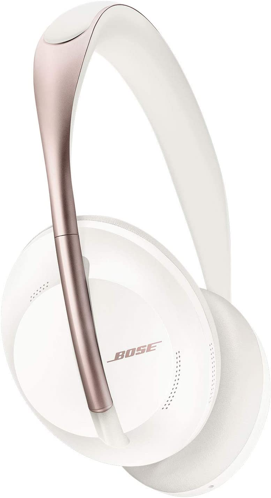
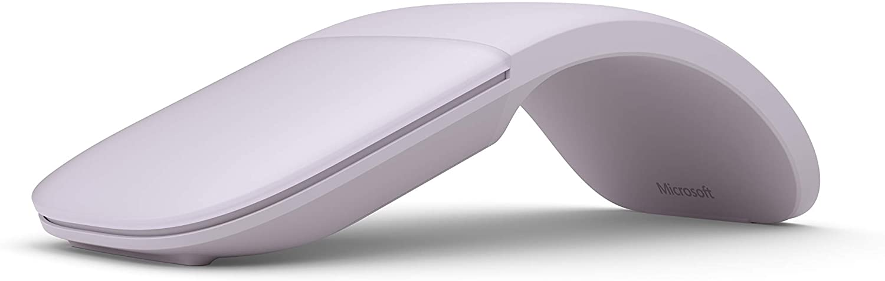
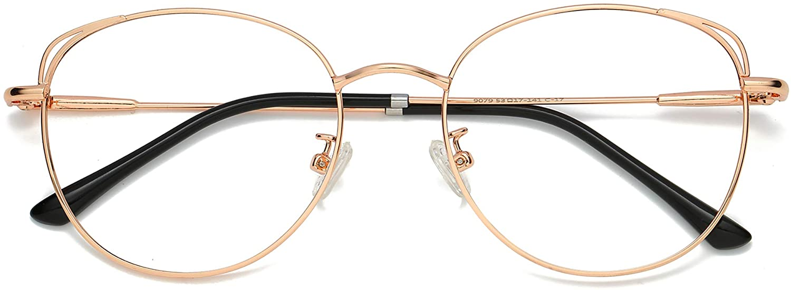
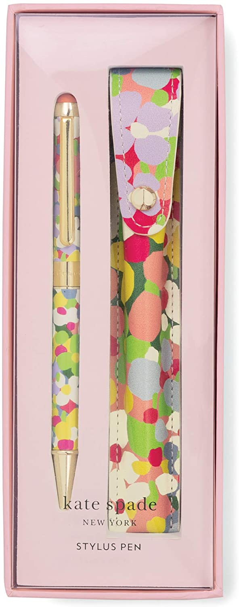
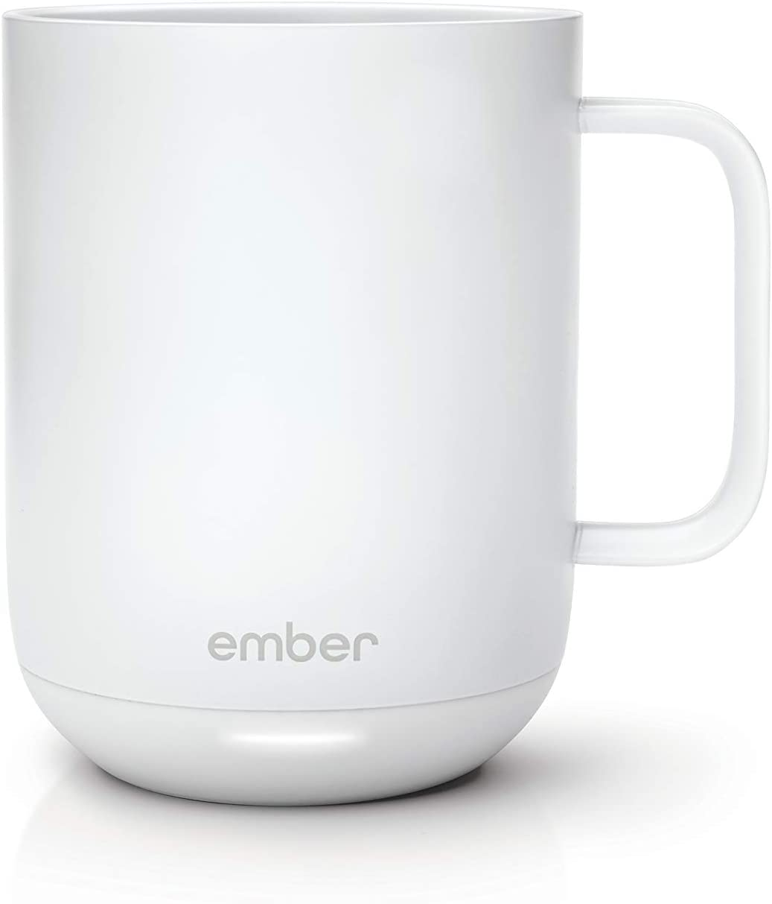

I know, you have the most special girl in the world, she is not any girl, she is a Coder as well. And you want to spoil her big time on the most romantic day of the year, so, here’s a Valentine’s day gift guide that has been carefully curated by one geek girl to make your special day even better!

*This is NOT a sponsored post, just a list of items I love.

1. Headphones. Do you know how important is music to enter the zone while trying to figure out where the bug in our code is? Or how wonderful is it to be able to silent the exterior world when we are super stressed? A good set of cute noise-canceling headphones will make your girl love you more each time she put her headphones on. These Bose with some pink details are a great choice!

[Bose Noise Cancelling Wireless Headphones](https://www.amazon.com/dp/B07X5F81JS/)

1. Mouse. Having a mouse that works smoothly and that fits well in our smaller hands is a blessing. Lately, I have been trying innumerable brands, and I have found some cute ones that are extra powerful. Just make sure the mouse you are choosing is compatible with your girl’s computer OS (Windows or Mac).

[Cute little Mouse from Microsoft](https://www.amazon.com/dp/B07Y42F5VG/)

1. Blue Light Blocking Glasses. All right, this might be new for you. But, as it turns out, computers are a source of blue-light, when we stare at our screens during those long hours our precious eyes suffer the consequences. That’s when these cute glasses come into play. They protect us from those blue-light rays and make us look even sexier. The best part, these are under $20!

[Rose-gold Blue Light Blocking Glasses](https://www.amazon.com/dp/B07MZ31QC7/)

1. A Beautiful Pen. Unlike you guys, a cute pen can totally uplift our mood. I love having cute little props on my desk at all times. This includes my pens. I have dedicated pens for different tasks, and each of them is very special to me. A Kate Spade pen is ideal for some of the most special occasions, you could not be wrong.

[Kate Spade NY Ballpoint Pen](https://www.amazon.com/Kate-Spade-New-York-Stylus/dp/B07M79TH34)

1. A smart mug. This could be a game-changer. If your girl codes, chances are she drinks coffee as her fuel all-day-long, if not coffee, tea. But I normally have to interrupt my precious coding time to reheat my coffee, as it turns cold after being sitting on my desk for a few hours. This mug is not only beautiful but will keep our precious fuel at the ideal temperature no matter how long we take to finish it.

[Beautiful Smart Mug](https://www.amazon.com/Ember-Temperature-Control-Mug-White/dp/B0773WG6NK)

And there you have it my dear friends, a list that will make your life easier and make this Valentine’s Day during a pandemic a much more memorable experience. Forget all the nonsense bulk made non-special gifts, these above are something your Coder Girl will truly love. (And love you more of course!)

Happy Valentine’s!!!

The Pink Dev

